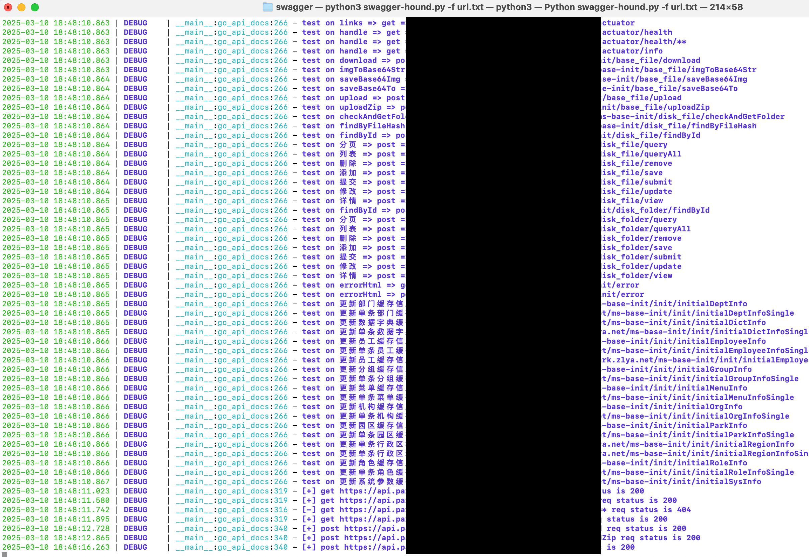
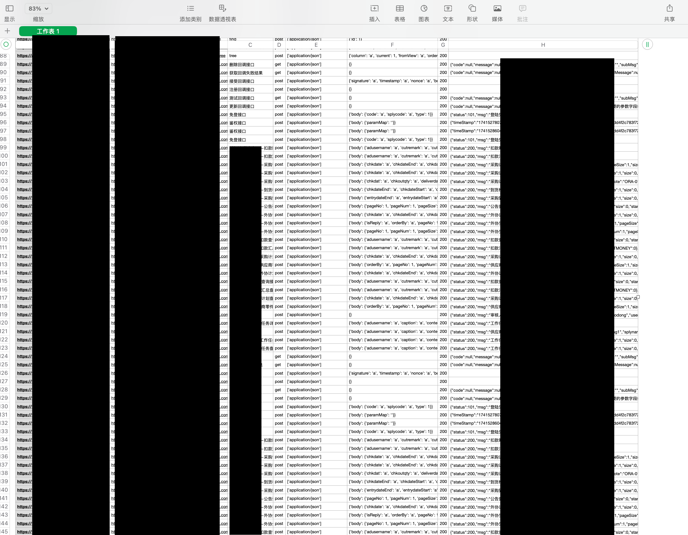

# SwaggerHound

针对大量 Swagger 目标并爬取所有接口并测试未授权漏洞, 通过阅读目前已公开相关项目代码发现一些痛点, 所以在前辈们项目基础上自己搓了一个。

痛点：
1. 不适用于在大量 Swagger 资产场景下。
2. 对于 Swagger API 文档参考不多且通用性差, 请求的参数格式细节也未作处理。
3. 代码不完整且存在 BUG, 作者也不在维护。

## 主要功能

- 支持单个目标和批量目标。
- 适配目标链接为 `/swagger-resources` 和 `/api/docs` 和 `swagger html`。
- 适配多个版本 Swagger API 文档。
- 自动爬取所有 API 链接, 对 GET 和 POST 进行请求 (危险请求方法进行跳过)。
- 根据文档数据请求类型和参数类型填充默认值。
- 支持爬取自定义的模型或对象并填充给参数。
- 支持控制台显示, 生成日志文件, 导出扫描结果。

## 使用方法

```bash
python3 swagger-hound.py -u https://xxxx.ztna.xxxxx.com/api/swagger-ui.html
python3 swagger-hound.py -u https://xxxx.ztna.xxxxx.com/api/v2/docs
python3 swagger-hound.py -u https://xxxx.ztna.xxxxx.com/api/swagger-resources

python3 swagger-hound.py -f url.txt
```





## 参考

感谢 @jayus0821 @lijiejie 

https://github.com/jayus0821/swagger-hack/tree/main
https://github.com/lijiejie/swagger-exp